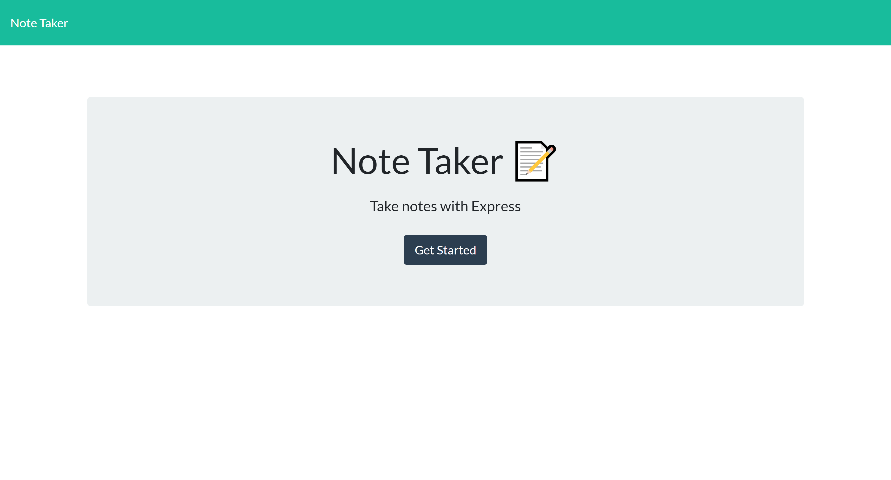
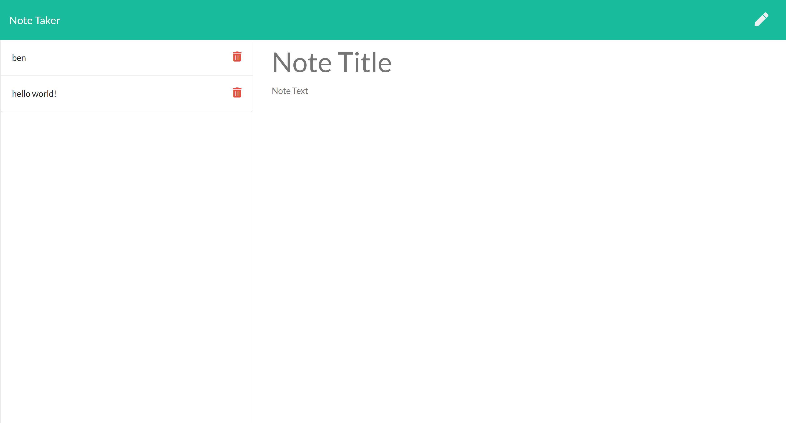
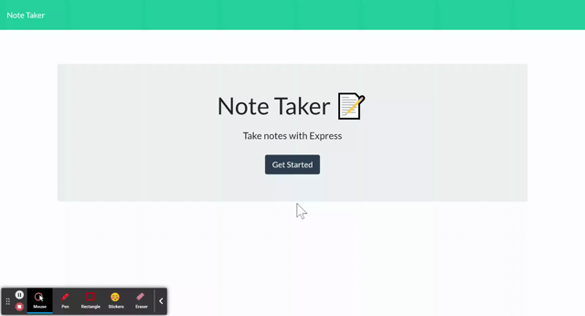

# Express-Note-Taker-App

 ## Table of Contents
1. [Description](#description)

2. [Installation](#installation)

3. [Usage](#usage)

4. [Contributions](#contributions)

5. [Questions](#questions)

-----

## Description
The Express Note Taker Application bridges application once stuck in the command prompt to the browser by using Express.Js. Express allows us to quickly set up a server via localhost. From there we can easily serve up Html files powered by Javascript to present the user with a dynamic application. This application was fun to work and gave me an opportunity to try out using async/await on the htmlroutes.js file. Areas I would like to improve on would be to refactor the code further to be 100% asynchronous and to add update requests to the user to complete the app as a fully functional CRUD application.

 -----

 ## Installation
 

   Getting Started:
   * check node is installed
   * npm installed
   * npm initialized
   * npm init
   * package.json and dependencies
  
    node -v
    npm install
    npm init --yes
    npm i express

  

 ## Usage

 ---

 Run the Application:
 

      node app.js
      OR
      nodemon app.js

 

   

Screenshot of Landing Page:
--

Screenshot of Notes Page:
--

GIF Demo:
--

Visit the Repo: 
[Github]**<https://github.com/bdurham227/Express-Note-Taker-App>**

   

 ## License
 

   https://opensource.org/licenses/MIT

    Licensed under the MIT License

    Copyright © [2021] [Benjamin Durham]
    

         Permission is hereby granted, free of charge, to any person obtaining a copy of this software and associated documentation files (the "Software"), to deal in the Software without restriction, including without limitation the rights to use, copy, modify, merge, publish, distribute, sublicense, and/or sell copies of the Software, and to permit persons to whom the Software is furnished to do so, subject to the following conditions:
        
        The above copyright notice and this permission notice shall be included in all copies or substantial portions of the Software.
        
        THE SOFTWARE IS PROVIDED "AS IS", WITHOUT WARRANTY OF ANY KIND, EXPRESS OR IMPLIED, INCLUDING BUT NOT LIMITED TO THE WARRANTIES OF MERCHANTABILITY, FITNESS FOR A PARTICULAR PURPOSE AND NONINFRINGEMENT. IN NO EVENT SHALL THE AUTHORS OR COPYRIGHT HOLDERS BE LIABLE FOR ANY CLAIM, DAMAGES OR OTHER LIABILITY, WHETHER IN AN ACTION OF CONTRACT, TORT OR OTHERWISE, ARISING FROM, OUT OF OR IN CONNECTION WITH THE SOFTWARE OR THE USE OR OTHER DEALINGS IN THE SOFTWARE

## Contribution
---

Jason Barbanel
 
https://github.com/Jbarbss
 
Takuya Matsomoto
 
https://github.com/TakuyaMats

 ## Questions
 ---
 For additional questions about usage, installation or application improvement contact me through

Github: https://github.com/bdurham227

Email: bdurham227@gmail.com:

     

